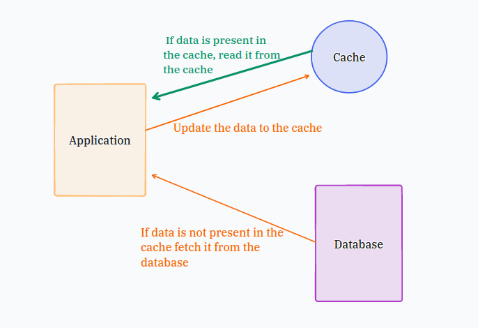
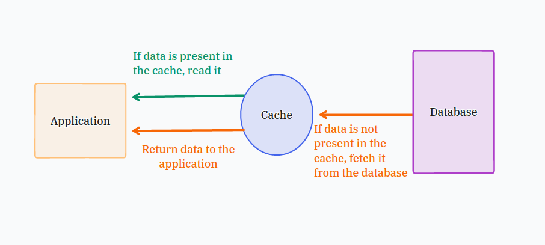
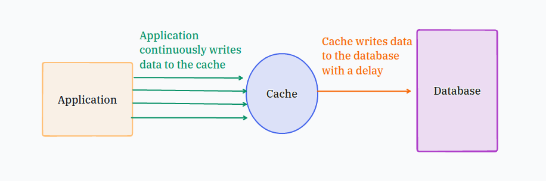
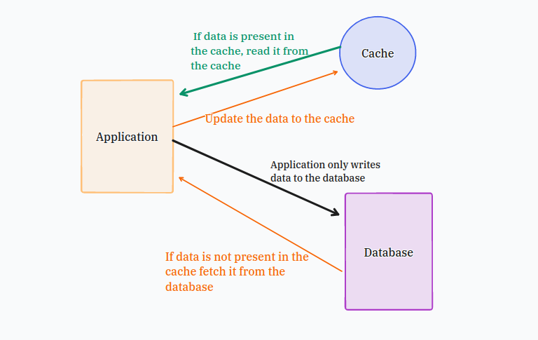

# Caching

---

## Introduction

- A cache is a storage location where frequently accessed data is stored. This allows the system to retrieve information much faster compared to fetching it from slower storage such as a database.

- Real-life Example:

    - Suppose a popular movie has just released and many users try to stream it. Normally, every request would require the server to query         the database, search for the movie, and then return the result. This repeated process increases load and latency.
      To avoid this, the system stores the movie data in a cache (usually in RAM). When any user requests the movie, the server directly           returns the data from the cache, making the process significantly faster.

---

## Caching's Purpose

- The main purpose of caching is to improve data retrieval performance by reducing the need to access slower storage layers.

- A cache trades capacity for speed: it stores a smaller subset of data temporarily, whereas a database stores complete and durable data.

---

## Applications of caching

- Caching are preferably used for multiple purposes and in different technologies like:
    
    - Operating System(OS)
    - Content Delivery Network(CDN)
    - Domain Name System(DNS)
    - Web Application
    - Database

- They are mainly used in such field and technologies because they have to handle and tackle huge loads of data at once while facing huge traffics which can cause latency which decreases the quality of services for users. So inorder to avoid this issues caching is used to avoid latency and improve the work-rate of many read-heavy application workloads.

- Cached information can include the results of database queries, computationally intensive calculations, API requests/responses and web artifacts such as HTML, JavaScript, and image files

---

## Caching Approaches & Strategies

- Cache-Aside
- Read-Through
- Write-Through
- Write-Back
- Write-Around

### Cache-Aside

- In this approach, whenever any data is requested if that data is available in cache it is returned, if not available the data is fetched from database by the application and stored in cache for future usage. 

- This is also know as lazy loading.

### Read-Through

- In this approach, when the data request comes the application checks the cache first if available return it, if the data doesn't exist in cache then cache goes to database loads the data in it and return the data to application.

### Write-Through

- In this mechanism, the application writes or loads the data in both cache and database simultaneously. However, it slows down write operations because of double the time write operation.

### Write-Back

- In this mechanism, the application writes the data in cache first and after some delay the data is written into the database.

### Write-Around

- Write-Around mechanism combines with a Read-Through caching approach or Cache-Aside strategy. The application always writes the data into the database and reads data from the cache. If there's a cache miss, the data is fetched from the database and then stored in the cache for future reads. This strategy works best when data is rarely updated and read in more often.

---

## References

- https://aws.amazon.com/caching/
- https://www.geeksforgeeks.org/dbms/what-is-caching-strategies-in-dbms/
- https://docs.aws.amazon.com/whitepapers/latest/database-caching-strategies-using-redis/caching-patterns.html
- https://www.youtube.com/watch?v=6FyXURRVmR0
- https://stackoverflow.com/questions/41604263/how-do-i-display-local-image-in-markdown

---
